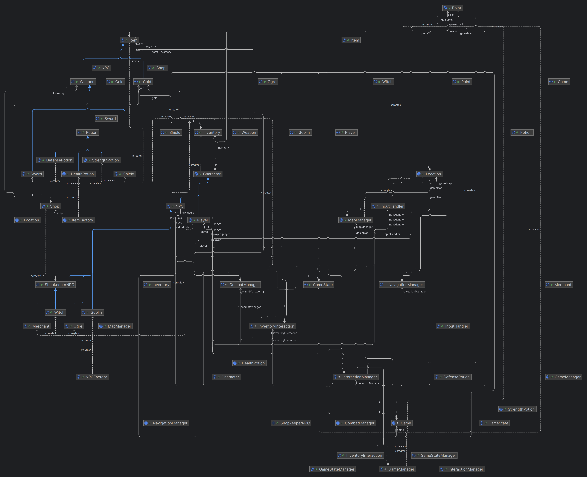
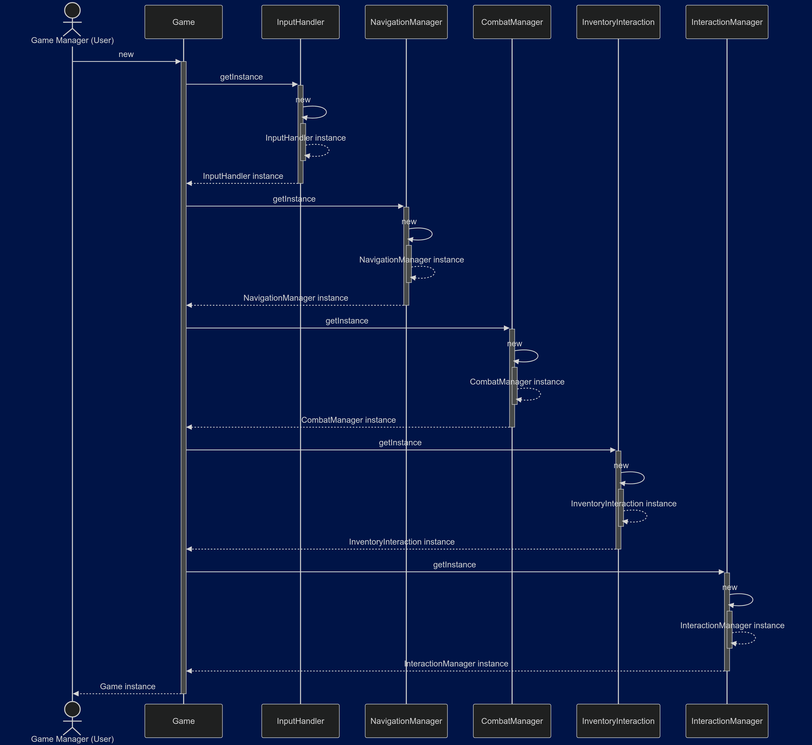

# 3D Text-Based RPG Adventure

This is my unique **text-based RPG built in Java**, showcasing a **3D** movement system and an adventure across a **5x5x2 grid**. This project exemplifies clean code principles, Object-Oriented Programming (OOP) and scalable design patterns, making it a perfect example of my game development knowledge.

## Project Highlights

**3D Exploration**: The player navigates a three-dimensional grid with vertical exploration capabilities.

**Modular Codebase**: Collection of 33 classes structured for maintainability and scalability.

**Dynamic Interactions**: Engage with NPCs, trade, combat and location-triggered events.

**Save/Load Functionality**: Persistent gameplay stored by .dat files.

**Combat and Economy**: Balanced gameplay mechanics with in-game currency and item effects.

## Core Architecture

 The game is organized into clear modules for seamless management:
### Core

**GameManager**: Handles overall game flow and state.

**CombatManager**: Coordinates turn-based combat mechanics.

**NavigationManager**: Ensures player movement adheres to the 3D map limits.

**InteractionManager**: Manages interactions between the Player and Locations, NPCs and Items.

### Model

**Character Hierarchy**: Base class extended into specific types (Player, NPC, ShopkeeperNPC, Ogre, Goblin, Witch and Merchant).

**Item Hierarchy**: Includes Sword, Shield, Potion, Gold and a Key to unlock the main objective and win game. This last Item is kept by a powerful Ogre.

**World**: Location and Point classes define the 3D map's structure.

### Gameplay

**Inventory**: Tracks and manages characters' items dynamically.
**Shop**: Enables the ShopkeeperNPC NPCs trading systems.

### Persistence

**GameStateManager & GameState**: Save and load game progress each 5 turns.

*For an in-depth view, consult the class diagram and sequence diagram included in the repository.*

## Technical Skills

### Data Structures:
**HashMap<Point, Location>**: Efficient location management for the 3D map.

**ArrayList**: Flexible tracking for inventories, NPCs, shops and items spread around the map.

### Design Patterns:
**Singleton**: Ensures single-instance classes where appropriate.

**Factory**: Simplifies NPC and item creation for scalability.

### OOP principles
Emphasizes encapsulation, inheritance and polymorphism throughout the codebase.

## Gameplay Overview

### Controls:
**Movement**: north, south, east, west, up, down.

**Inventory Management**: inventory.

**Combat**: fight or run.

**Interaction**s: talk, buy, sell, pay, nothing or exit.

**Objective**: Save the princess from the Swamp Ogre by navigating around the map, gathering items and overcoming challenges.

## Visuals

### Class Dependency Overview
  
*Visualizing the dependencies between major classes in the project.*

### Comprehensive Class Diagram
  
*Visualizing key classes and their relationships.*

### Sequence Diagram - Gameplay
  
*Demonstrating how the core classes interact with each other.*

## Future Enhancements

Expand biomes for richer exploration.

Introduce more character classes and combat abilities.

Implement a quest-driven storyline for deeper engagement.

Refine the combat system for added complexity.

## Skills Demonstrated

Java Knowledge: Focus on Object Oriented Programming principles, including encapsulation, polymorphism. Also used factories and singletons.

Software Design: Design is made for smooth scalability.

Game Development: Interesting game mechanics including inventory systems, essential game-winning items, specific locations with events and engaging NPC interactions.

## How to Run

Clone the repository.

Compile and execute using java -jar rpg-game.jar.
